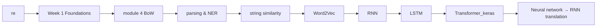

# 🎓 In Class — Lecture Materials

> A bundle of in-classroom notebooks covering the **deeper / more advanced** side of NLP:
> regex, BoW, parsing, NER, similarity, **Word2Vec**, **RNNs**, **LSTMs**, **Transformers** and an end-to-end **RNN translation** demo.

---

## 📁 Folder Map

| Folder | Topic |
|--------|-------|
| 📂 [`re/`](./re/) | Python `re` module + NLTK punkt experiments |
| 📂 [`Week 1 Text Foundations/`](./Week%201%20Text%20Foundations/) | Same Week-1 lab as the top-level NLP folder |
| 📂 [`module 4 feature extraction/`](./module%204%20feature%20extraction/) | Bag-of-Words walkthrough |
| 📂 [`parsing/`](./parsing/) | POS / dependency parsing |
| 📂 [`named entity recognition and extraction/`](./named%20entity%20recognition%20and%20extraction/) | NER with spaCy |
| 📂 [`string similarity (distances)/`](./string%20similarity%20%28distances%29/) | Edit distance, Jaccard, cosine |
| 📂 [`Word2Vec/`](./Word2Vec/) | Train Word2Vec embeddings from scratch |
| 📂 [`Neural network/`](./Neural%20network/) | Basic NN for text + nested **RNN translation** demos |
| 📂 [`RNN/`](./RNN/) | Step-by-step Recurrent Neural Network |
| 📂 [`LSTM/`](./LSTM/) | Long Short-Term Memory networks |
| 📂 [`Transformer_keras/`](./Transformer_keras/) | Transformer architecture in Keras |
| 📂 [`dump/`](./dump/) | Misc / scratch notebooks |

---

## 🛤️ Suggested Order



---

## 🛠️ Requirements

```bash
pip install nltk spacy scikit-learn gensim tensorflow keras \
            matplotlib seaborn pandas numpy

python -m spacy download en_core_web_sm
python -c "import nltk; nltk.download('punkt'); nltk.download('stopwords'); nltk.download('wordnet')"
```

---

## 💡 Tip

The notebooks in this folder often **duplicate** topics from the top-level NLP folder — that's intentional. The top-level folder is for your own practice; `In Class/` keeps the original lecture material untouched.
