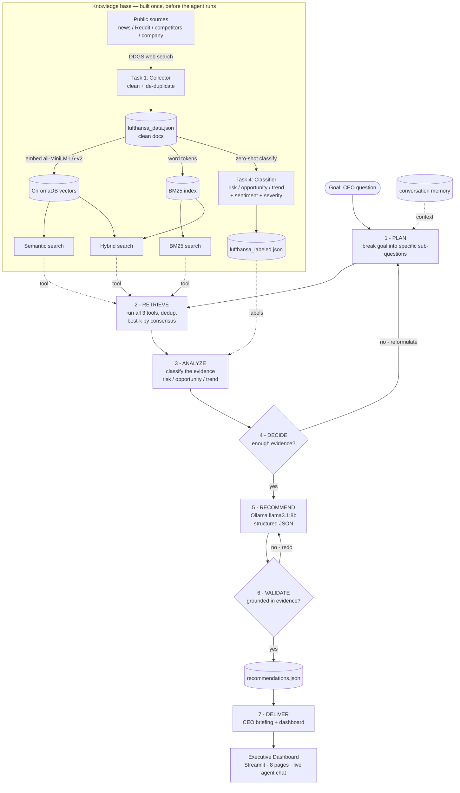
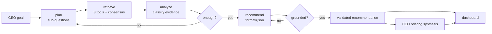

# AI CEO: Strategic Intelligence Agent — Lufthansa

An AI-powered Strategic Intelligence Agent that automatically collects live public information
about **Lufthansa**, stores and indexes it, analyzes it for opportunities / risks / trends, and
uses a **local open-source LLM** to reason over the evidence and generate **executive-level,
evidence-based recommendations** — presented in an interactive dashboard.

It runs as an **autonomous AI agent**: given a goal, it **plans** its approach, **retrieves**
evidence using multiple tools, **analyzes** it, **decides** whether the evidence is sufficient
(searching again if not), **recommends** an action, and **validates** that recommendation against
the evidence before presenting it — a **Goal → Plan → Retrieve → Analyze → Decide → Recommend →
Validate** workflow. Every step is shown, so the agent's reasoning is transparent rather than a
black box.

> **The goal is not information retrieval. The goal is strategic decision-making.**
> The system is built to answer: *"If you were the CEO today, what would you do next and why?"*

---

## Table of Contents
1. [Status](#status)
2. [Features](#features)
3. [Technology Stack](#technology-stack)
4. [System Architecture](#system-architecture-diagram)
5. [Data Flow](#data-flow-diagram)
6. [AI Pipeline](#ai-pipeline)
7. [Design Decisions](#design-decisions)
8. [Project Structure](#project-structure)
9. [Setup & Installation](#setup--installation)
10. [How to Run](#how-to-run)
11. [Limitations & Future Work](#limitations--future-work)

---

## Status

| Component | Status |
|-----------|--------|
| Task 1 — Live Data Collection | ✅ Done |
| Task 2 — Knowledge Repository (store + index) | ✅ Done |
| Task 3 — Information Processing (clean + embed) | ✅ Done (folded into Task 2) |
| Retrieval Layer — Semantic + Hybrid (BM25 + dense) | ✅ Done |
| Task 4 — Strategic Intelligence Engine (classify + sentiment) | ✅ Done |
| Task 5 & 6 — AI CEO Agent + Evidence-Based Recommendations | ✅ Done |
| Section 7 — CEO Briefing (executive summary) | ✅ Done |
| Executive Dashboard (Streamlit, 8 pages + live chat) | ✅ Done |
| Dashboard bonus — Semantic vs Hybrid comparison panel | ⚪ Optional |

### Agentic Upgrade (for the 30 June retake) — ✅ COMPLETE

The system has been extended from a single-pass RAG pipeline into a full **AI agent** with explicit
planning, multi-tool use, self-correction, memory, and validation — a **Goal → Plan → Retrieve →
Analyze → Decide → Recommend → Validate** loop, implemented in `agent.py` (`run_agent`) and wired
into the dashboard's live chat. Every step prints its reasoning (transparency).

| Agent step | What it does | Status |
|-----------|--------------|--------|
| **Plan** | break the goal into specific sub-questions | ✅ Built |
| **Retrieve** | per sub-question, run **3 tools** (semantic + BM25 + hybrid), dedup, keep best-k by **consensus** | ✅ Built |
| **Analyze** | classify the retrieved evidence (risk / opportunity / trend) | ✅ Built |
| **Decide** | judge if evidence is enough; reformulate & search again if not (capped loop) | ✅ Built |
| **Recommend** | structured, evidence-based recommendation | ✅ Built (reuses Task 5/6 prompt) |
| **Validate** | check the recommendation is grounded in evidence; redo if not | ✅ Built |
| **Memory** | resolve follow-up questions ("what about that?") using conversation history | ✅ Built |
| **Orchestrator** | tie the loop together (`run_agent`), all steps shown | ✅ Built |

---

## Features

- **Automatic live data collection** from multiple independent public sources
- **≥ 100 documents** collected, cleaned, de-duplicated, and stored (**341** after cleaning)
- **Vector knowledge base** with semantic search (ChromaDB)
- **Hybrid retrieval** combining keyword (BM25) and semantic (embeddings) search
- **Zero-shot classification** of each document into Opportunity / Risk / Trend
- **Sentiment analysis** (news vs. public)
- **Local open-source LLM reasoning** (no paid APIs) for strategic recommendations
- **Evidence-based recommendations** with supporting sources, expected impact, and risk
- **Executive dashboard** (Streamlit) — 8 pages: Overview · Market Intelligence · Opportunities ·
  Risks · Trends · Sentiment · Recommendations · CEO Briefing
- **Live "Ask the AI CEO" chat** — a floating widget that runs the full agent on any question
  the user types, returning a grounded, structured recommendation with clickable sources

---

## Technology Stack

| Layer | Tool | Purpose |
|-------|------|---------|
| Language | **Python 3.11** | core implementation |
| Data collection | **ddgs** (DuckDuckGo Search) | live web search across sources |
| Embeddings | **sentence-transformers** (`all-MiniLM-L6-v2`) | text → 384-dim vectors |
| Vector store | **ChromaDB** (`PersistentClient`) | store + index + semantic search |
| Keyword retrieval | **rank_bm25** (`BM25Okapi`) | sparse keyword matching |
| Similarity / utils | **scikit-learn** (`cosine_similarity`, `PCA`) | scoring + visualization |
| Classification | **transformers** (`facebook/bart-large-mnli`) | zero-shot Opportunity/Risk/Trend |
| Sentiment | **transformers** (`cardiffnlp/twitter-roberta-base-sentiment-latest`) | 3-class sentiment: negative / neutral / positive |
| Reasoning LLM | **Ollama** (`llama3.1:8b`) | local, open-source reasoning engine |
| Dashboard | **Streamlit** | interactive executive dashboard |
| Visualization | **matplotlib** | charts |

> **No paid commercial LLM APIs are used.** The reasoning engine is a local, open-source model
> served via Ollama, satisfying the project constraint.

---

## System Architecture Diagram



> **Accuracy notes (matches the code):** Cleaning happens **once at collection** (Task 1), so `lufthansa_data.json` is already clean (341 docs). **Task 4** saves, per document: `category` + its zero-shot **confidence** (`category_score`), 3-class **sentiment**, and a zero-shot **severity** for risks; the LLM rates each opportunity's **impact** (High / Medium / Low). The **agent** treats all three retrievers — *semantic*, *BM25*, and *hybrid* — as **tools**: for each planned sub-question it runs all three, pools the results, dedups by URL, and keeps the best documents by **consensus** (documents found by more methods rank higher). The Analyze step reads the Task-4 labels of the retrieved docs.

---

## AI Agent Workflow

The agent turns a CEO **goal** into a **validated recommendation** through 7 explicit, visible steps.
Each step's output is printed, so the reasoning is transparent (not a black box).

| # | Step | What happens | How |
|---|------|--------------|-----|
| 1 | **Plan** | break the goal into 2–4 specific, keyword-rich sub-questions | LLM (`make_plan`) |
| 2 | **Retrieve** | for each sub-question, run **all 3 tools** (semantic + BM25 + hybrid), dedup by URL, keep best-k by **consensus** | tools (`retrieve_evidence`, `gather_evidence`) |
| 3 | **Analyze** | classify the retrieved evidence (risk / opportunity / trend) by reading the Task-4 labels | classifier labels |
| 4 | **Decide** | judge whether the evidence is enough; if not, reformulate the query and retrieve again (capped loop) | LLM |
| 5 | **Recommend** | write the structured recommendation (action + justification + evidence + impact + risk + priority) | LLM (reuses Task 5/6) |
| 6 | **Validate** | check every claim is grounded in the evidence; if not, regenerate (capped loop) | LLM |
| 7 | **Deliver** | the validated recommendation goes to `recommendations.json` and the dashboard | — |

**Agent capabilities demonstrated:** planning before execution · tool use beyond the LLM · autonomous
decision-making (sufficiency + reformulation) · retrieval and use of evidence · analysis of risks /
opportunities / trends · validation of recommendations before presenting. Built from plain Python +
Ollama (no agent framework) for full control and explainability.

---

## Data Flow Diagram



**Plain-language flow (the agent loop):**
`goal → plan → retrieve (3 tools, consensus) → analyze → decide (enough?) → recommend → validate (grounded?) → deliver`

> The two diamonds — **decide** and **validate** — can loop back, which is what makes this an *agent*
> (it self-corrects) rather than a one-shot pipeline. All three retrievers are used together as tools.

---

## AI Pipeline

The system uses **five AI/ML components**, each with a specific job:

| Stage | Model / Algorithm | Role |
|-------|-------------------|------|
| Embedding | `all-MiniLM-L6-v2` (transformer) | turn text into 384-dim meaning vectors |
| Sparse retrieval | BM25 (algorithm, not ML) | exact keyword matching |
| Classification | `bart-large-mnli` (zero-shot via NLI) | Opportunity / Risk / Trend |
| Sentiment | `cardiffnlp/twitter-roberta-base-sentiment-latest` | negative / neutral / positive tone |
| Reasoning & generation | `llama3.1:8b` (LLM via Ollama) | reason over evidence, write recommendations |

**Two layers of intelligence:**
- **Interpretation intelligence** (Task 4): small specialized models *label* each document.
- **Reasoning intelligence** (Task 5): the LLM *reasons across* documents to recommend actions.

**Retrieval-Augmented Generation (RAG):** the LLM never answers from memory alone — relevant
documents are retrieved and injected into the prompt, so answers are **grounded in live evidence**
and every recommendation is traceable to its source documents.

---

## Design Decisions

> These are the deliberate "why this, not that" choices behind the system.

**1. DDGS (DuckDuckGo Search) for collection, not direct scraping.**
No API key, no paid service (satisfies the open/free constraint). Independence is achieved by
querying different *content origins* (news, Reddit, company site) via `site:` filters, and volume
by running many query angles per origin. *Trade-off:* DDGS returns snippets, not full articles —
acceptable, since breadth of sources matters more than depth for strategic intelligence, and the
URL is kept as evidence.

**2. Three independent origins (news / Reddit / company) + competitor coverage.**
Maps to the brief's source categories: News, Community, Company (+ Market). Three *different voices*
(journalists, public, the company itself) — a stronger independence story than three news sites.

**3. Wikipedia dropped.** Its Python library repeatedly returned malformed JSON on this setup;
relying on a flaky component for a graded live demo is a risk. The official company site (via DDGS)
is a more reliable *and* primary source.

**4. De-duplication by URL *and* text.** The same article surfaces under multiple queries; a dict
keyed by URL keeps one copy per article. But different URLs can carry identical text (URL-uniqueness
≠ content-uniqueness), so a second dedup keyed by text removes those too.

**5. ChromaDB over FAISS.** Chroma stores text + embedding + metadata *together* and persists to
disk, so every pipeline stage and the dashboard can reuse the same indexed store. FAISS is a bare
vector index with no metadata/persistence — better only at million-scale. For this corpus, Chroma's
convenience wins.

**6. `PersistentClient`, not in-memory.** The pipeline spans multiple notebooks and a separate
dashboard process; in-memory storage lives in one process's RAM. Persisting to disk lets every
stage open the same store without re-embedding.

**7. Light cleaning at the source (no stopword removal / stemming / lowercasing).**
Cleaning runs in the collection stage so the saved data is already clean and every downstream stage
uses it consistently. Applied: whitespace normalization, drop near-empty docs, drop low-information
navigation/listing pages (few unique words), and text de-duplication. Deliberately *avoided*:
lowercasing, stopword removal, stemming, number/punctuation removal — transformer embeddings are
trained on natural language and rely on case, punctuation, numbers, and stopwords for meaning
(heavy cleaning helps BoW/TF-IDF, not embeddings). Rule: remove *noise*, never *meaning*.

**8. No chunking.** Documents are short search snippets — already single-topic units. Chunking only
helps long documents (e.g. PDFs), where one vector would blur many topics.

**9. Hybrid search (BM25 + dense).** Embeddings capture meaning but blur rare exact terms
(e.g. "A350-1000" gets split into subwords and averaged out); BM25 matches such terms literally.
Scores are min-max normalized to 0–1 and combined with a weight `alpha` (default 0.5). Observed
behavior: hybrid acts as a *safety net* — it helps mainly on keyword-heavy queries and stays
neutral on conceptual ones.

**10. Zero-shot classification for Opportunity/Risk/Trend.** No labeled data and no time to label.
`bart-large-mnli` classifies into labels defined at runtime via NLI entailment, so no training is
needed. Kept to 3 main categories for robustness (subtypes available on demand as a two-level
classifier, but more labels lower confidence).

**11. Three-class sentiment, not binary.** The initial choice (`distilbert-sst-2`) has only
positive/negative and was trained on movie reviews, so it forced neutral, factual pages (e.g. report
listings) into positive/negative with misleadingly high confidence. Switched to
`cardiffnlp/twitter-roberta-base-sentiment-latest` (negative/neutral/positive, trained on social
text) so neutral documents are correctly labeled neutral — confirmed by the result distribution
(neutral 207, positive 95, negative 39).

**12. Small models for labeling, LLM for reasoning.** Classification/sentiment over ~341 docs needs
speed, not reasoning — small specialized models are ideal. The 8B LLM is reserved for Task 5, where
the system must read evidence, reason, and *write* justified recommendations — something classifiers
cannot do.

**13. Local open-source LLM (Ollama / Llama 3.1 8B).** Required by the brief (no paid APIs). Runs
locally and free, with strong enough reasoning for executive recommendations. (Model storage
relocated off the system drive via `OLLAMA_MODELS`.)

**14. Streamlit for the dashboard.** Pure-Python, minimal boilerplate — faster to build a
data-centric executive dashboard than Dash's callback wiring.

**15. Static pages load saved JSON; only the chat calls the LLM live.** The 8B model takes ~2.5 min
per call on CPU, so the recommendations and briefing are *pre-generated once* to
`recommendations.json` / `ceo_briefing.json` and the dashboard simply loads them (instant). The LLM
is invoked live in exactly **one** place — the floating "Ask the AI CEO" chat — where the user's own
question runs through the full RAG agent on demand. Heavy resources (the Chroma collection and the
embedding model) are cached with `@st.cache_resource`; the JSON data with `@st.cache_data`.

**16. Filter each list page by the axis that's meaningful for it.** Category and sentiment are
*independent* labels (category = topic, sentiment = tone), so filtering the **Risk** page by sentiment
would produce nonsense like "positive risks." The Risk page therefore filters by **source** (*where is
this risk coming from?* — news / competitor / community), while **Trends** and **Opportunities** filter
by **sentiment** (a "positive vs negative trend" is a genuine, useful distinction).

**17. The agent retrieves with all three tools and fuses them by consensus — backed by evaluation.**
The agent does not bet on a single retriever; for each planned sub-question it runs **semantic, BM25,
and hybrid**, pools the results, dedups by URL, and keeps the documents they **agree on** (ranked by how
many methods found each doc, tie-broken by average rank). This consensus design is justified by
evaluation showing the three methods are **complementary, not redundant**:
- *Overlap:* semantic vs hybrid share only ~1–2 of 5 top documents, semantic vs BM25 just ~0.4/5 — the
  methods retrieve **different evidence**.
- *Relevance:* scoring each retriever's top-5 against the Task-4 category labels gave semantic 6, hybrid
  7, BM25 5 (of 20) — **comparable, no single winner**, and which wins is question-dependent.

Because no method dominates and each surfaces documents the others miss, **fusing all three by consensus
is more robust than choosing one**: a document found by multiple methods is a higher-confidence result,
and a strong single-method match (e.g. BM25 on an exact model number like "A350-1000") still survives the
vote rather than being averaged away by a blend. The cost is ~3× the retrieval calls per sub-question —
acceptable for an interactive agent. *(The pre-generated `recommendations.json` was produced earlier by a
simpler semantic-only pass; the live agent uses the consensus retriever. Fully adaptive **query routing**
— pick the retriever per question type instead of always fusing — is noted as future work.)*

---

## Project Structure

```
AI CEO Strategic Intelligence Agent/
├── README.md                           # this file
├── requirements.txt                    # Python dependencies
│
├── Data Collection.ipynb               # Task 1 — DDGS collector + clean + dedup
├── Knowledge Repository.ipynb          # Task 2/3 — store + embed + retrieval (semantic + hybrid)
├── Strategic Intelligence Engine.ipynb # Task 4 — zero-shot classification + sentiment
├── CEO Agent.ipynb                     # Task 5/6 + agent build (Plan → ... → Validate)
│
├── retrieval.py                        # the 3 retrieval tools (semantic / BM25 / hybrid)
├── agent.py                            # the AI agent — run_agent() (Goal→Plan→Retrieve→Analyze→Decide→Recommend→Validate)
├── app.py                              # Executive dashboard (Streamlit) — 8 pages + live agent chat
│
├── data/                               # all JSON data
│   ├── lufthansa_data.json             #   341 clean, deduped docs (Task 1 output)
│   ├── lufthansa_labeled.json          #   same docs + category / sentiment / severity (Task 4 output)
│   ├── recommendations.json            #   pre-generated CEO recommendations (Task 5/6)
│   └── ceo_briefing.json               #   executive summary (Section 7)
├── chroma_db/                          # persistent vector store (Task 2)
├── images/                             # dashboard images
│   ├── background.jpg                  #   Overview cover image
│   └── lufthansa.png                   #   sidebar / fallback banner
└── backups/                            # local notebook / file backups
```

---

## Setup & Installation

```bash
# 1. Python dependencies
pip install ddgs sentence-transformers chromadb rank_bm25 scikit-learn \
            transformers torch streamlit matplotlib numpy

# 2. Local LLM (open-source, via Ollama)
#    Install Ollama from https://ollama.com  then:
ollama pull llama3.1:8b
```

> The first run of each transformer model downloads it from Hugging Face (one-time).

---

## How to Run

```bash
# Task 1 — collect data            → produces lufthansa_data.json (341 clean docs)
#   run: Data Collection.ipynb

# Task 2/3 — build knowledge base  → produces chroma_db/ + retrieval functions
#   run: Knowledge Repository.ipynb

# Task 4 — classify + sentiment    → produces lufthansa_labeled.json
#   run: Strategic Intelligence Engine.ipynb

# Task 5/6 + Section 7 — recommendations + briefing
#   run: CEO Agent.ipynb           → produces recommendations.json + ceo_briefing.json

# Dashboard (run from this folder)
streamlit run app.py
```

> The dashboard loads the saved JSON artifacts, so it opens instantly. The floating **"Ask the AI CEO"**
> chat is the only feature that calls the LLM live — it needs **Ollama running** (`ollama serve`) with
> `llama3.1:8b` pulled.

---

## Limitations & Future Work

- **Snippets, not full articles** — DDGS returns previews; full-text fetching could deepen analysis.
- **English-only models** — non-English documents would be classified unreliably; the corpus is
  English in practice. Multilingual models could be added.
- **Sentiment trends over time** need per-document dates, which snippets don't reliably include;
  sentiment is currently aggregated by source (news vs. public).
- **Zero-shot confidence is modest** on generic snippets; the category is a rough sort refined by
  the LLM's reasoning downstream.
- **Future:** finer subtype classification, date extraction for trend lines, and an automated
  refresh schedule for continuous monitoring.

---

*Author: Nihal Pujari — NLP module final examination project.*
