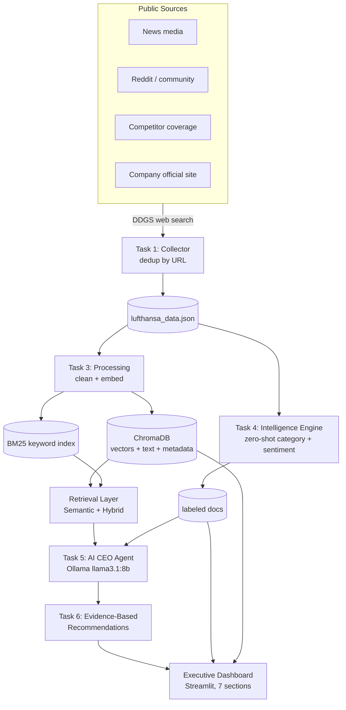

# AI CEO: Strategic Intelligence Agent — Lufthansa

An AI-powered Strategic Intelligence Agent that automatically collects live public information
about **Lufthansa**, stores and indexes it, analyzes it for opportunities / risks / trends, and
uses a **local open-source LLM** to reason over the evidence and generate **executive-level,
evidence-based recommendations** — presented in an interactive dashboard.

> **The goal is not information retrieval. The goal is strategic decision-making.**
> The system is built to answer: *"If you were the CEO today, what would you do next and why?"*

---

## Table of Contents
1. [Status](#status)
2. [Features](#features)
3. [Technology Stack](#technology-stack)
4. [System Architecture](#system-architecture-diagram)
5. [Data Flow](#data-flow-diagram)
6. [AI Pipeline](#ai-pipeline)
7. [Design Decisions](#design-decisions)
8. [Project Structure](#project-structure)
9. [Setup & Installation](#setup--installation)
10. [How to Run](#how-to-run)
11. [Limitations & Future Work](#limitations--future-work)

---

## Status

| Component | Status |
|-----------|--------|
| Task 1 — Live Data Collection | ✅ Done |
| Task 2 — Knowledge Repository (store + index) | ✅ Done |
| Task 3 — Information Processing (clean + embed) | ✅ Done (folded into Task 2) |
| Retrieval Layer — Semantic + Hybrid (BM25 + dense) | ✅ Done |
| Task 4 — Strategic Intelligence Engine (classify + sentiment) | ✅ Done |
| Task 5 & 6 — AI CEO Agent + Evidence-Based Recommendations | ✅ Done |
| Section 7 — CEO Briefing (executive summary) | ✅ Done |
| Executive Dashboard (Streamlit, 7 sections) | 🔶 Next |

---

## Features

- **Automatic live data collection** from multiple independent public sources
- **≥ 100 documents** collected, de-duplicated, and stored (~200 currently)
- **Vector knowledge base** with semantic search (ChromaDB)
- **Hybrid retrieval** combining keyword (BM25) and semantic (embeddings) search
- **Zero-shot classification** of each document into Opportunity / Risk / Trend
- **Sentiment analysis** (news vs. public)
- **Local open-source LLM reasoning** (no paid APIs) for strategic recommendations
- **Evidence-based recommendations** with supporting sources, expected impact, and risk
- **Executive dashboard** for decision-makers

---

## Technology Stack

| Layer | Tool | Purpose |
|-------|------|---------|
| Language | **Python 3.11** | core implementation |
| Data collection | **ddgs** (DuckDuckGo Search) | live web search across sources |
| Embeddings | **sentence-transformers** (`all-MiniLM-L6-v2`) | text → 384-dim vectors |
| Vector store | **ChromaDB** (`PersistentClient`) | store + index + semantic search |
| Keyword retrieval | **rank_bm25** (`BM25Okapi`) | sparse keyword matching |
| Similarity / utils | **scikit-learn** (`cosine_similarity`, `PCA`) | scoring + visualization |
| Classification | **transformers** (`facebook/bart-large-mnli`) | zero-shot Opportunity/Risk/Trend |
| Sentiment | **transformers** (`cardiffnlp/twitter-roberta-base-sentiment-latest`) | 3-class sentiment: negative / neutral / positive |
| Reasoning LLM | **Ollama** (`llama3.1:8b`) | local, open-source reasoning engine |
| Dashboard | **Streamlit** | interactive executive dashboard |
| Visualization | **matplotlib** | charts |

> **No paid commercial LLM APIs are used.** The reasoning engine is a local, open-source model
> served via Ollama, satisfying the project constraint.

---

## System Architecture Diagram



---

## Data Flow Diagram


**Plain-language flow (the RAG pipeline):**
`collect → clean → embed → store/index → retrieve → augment prompt → generate → display`

---

## AI Pipeline

The system uses **five AI/ML components**, each with a specific job:

| Stage | Model / Algorithm | Role |
|-------|-------------------|------|
| Embedding | `all-MiniLM-L6-v2` (transformer) | turn text into 384-dim meaning vectors |
| Sparse retrieval | BM25 (algorithm, not ML) | exact keyword matching |
| Classification | `bart-large-mnli` (zero-shot via NLI) | Opportunity / Risk / Trend |
| Sentiment | `cardiffnlp/twitter-roberta-base-sentiment-latest` | negative / neutral / positive tone |
| Reasoning & generation | `llama3.1:8b` (LLM via Ollama) | reason over evidence, write recommendations |

**Two layers of intelligence:**
- **Interpretation intelligence** (Task 4): small specialized models *label* each document.
- **Reasoning intelligence** (Task 5): the LLM *reasons across* documents to recommend actions.

**Retrieval-Augmented Generation (RAG):** the LLM never answers from memory alone — relevant
documents are retrieved and injected into the prompt, so answers are **grounded in live evidence**
and every recommendation is traceable to its source documents.

---

## Design Decisions

> These are the deliberate "why this, not that" choices behind the system.

**1. DDGS (DuckDuckGo Search) for collection, not direct scraping.**
No API key, no paid service (satisfies the open/free constraint). Independence is achieved by
querying different *content origins* (news, Reddit, company site) via `site:` filters, and volume
by running many query angles per origin. *Trade-off:* DDGS returns snippets, not full articles —
acceptable, since breadth of sources matters more than depth for strategic intelligence, and the
URL is kept as evidence.

**2. Three independent origins (news / Reddit / company) + competitor coverage.**
Maps to the brief's source categories: News, Community, Company (+ Market). Three *different voices*
(journalists, public, the company itself) — a stronger independence story than three news sites.

**3. Wikipedia dropped.** Its Python library repeatedly returned malformed JSON on this setup;
relying on a flaky component for a graded live demo is a risk. The official company site (via DDGS)
is a more reliable *and* primary source.

**4. De-duplication by URL.** The same article surfaces under multiple queries; a dict keyed by URL
keeps one copy per article (same uniqueness property as a set, but it carries the full document).

**5. ChromaDB over FAISS.** Chroma stores text + embedding + metadata *together* and persists to
disk, so every pipeline stage and the dashboard can reuse the same indexed store. FAISS is a bare
vector index with no metadata/persistence — better only at million-scale. For this corpus, Chroma's
convenience wins.

**6. `PersistentClient`, not in-memory.** The pipeline spans multiple notebooks and a separate
dashboard process; in-memory storage lives in one process's RAM. Persisting to disk lets every
stage open the same store without re-embedding.

**7. Light cleaning only (no stopword removal / stemming / lowercasing).**
Transformer embeddings are trained on natural language and rely on case, punctuation, and stopwords
for meaning. Heavy cleaning helps BoW/TF-IDF, not embeddings. Only whitespace normalization and
dropping near-empty docs are applied (kept as defensive code for future live data).

**8. No chunking.** Documents are short search snippets — already single-topic units. Chunking only
helps long documents (e.g. PDFs), where one vector would blur many topics.

**9. Hybrid search (BM25 + dense).** Embeddings capture meaning but blur rare exact terms
(e.g. "A350-1000" gets split into subwords and averaged out); BM25 matches such terms literally.
Scores are min-max normalized to 0–1 and combined with a weight `alpha` (default 0.5). Observed
behavior: hybrid acts as a *safety net* — it helps mainly on keyword-heavy queries and stays
neutral on conceptual ones.

**10. Zero-shot classification for Opportunity/Risk/Trend.** No labeled data and no time to label.
`bart-large-mnli` classifies into labels defined at runtime via NLI entailment, so no training is
needed. Kept to 3 main categories for robustness (subtypes available on demand as a two-level
classifier, but more labels lower confidence).

**11. Three-class sentiment, not binary.** The initial choice (`distilbert-sst-2`) has only
positive/negative and was trained on movie reviews, so it forced neutral, factual pages (e.g. report
listings) into positive/negative with misleadingly high confidence. Switched to
`cardiffnlp/twitter-roberta-base-sentiment-latest` (negative/neutral/positive, trained on social
text) so neutral documents are correctly labeled neutral — confirmed by the result distribution
(neutral 118, positive 55, negative 27).

**12. Small models for labeling, LLM for reasoning.** Classification/sentiment over ~200 docs needs
speed, not reasoning — small specialized models are ideal. The 8B LLM is reserved for Task 5, where
the system must read evidence, reason, and *write* justified recommendations — something classifiers
cannot do.

**13. Local open-source LLM (Ollama / Llama 3.1 8B).** Required by the brief (no paid APIs). Runs
locally and free, with strong enough reasoning for executive recommendations. (Model storage
relocated off the system drive via `OLLAMA_MODELS`.)

**14. Streamlit for the dashboard.** Pure-Python, minimal boilerplate — faster to build a
data-centric executive dashboard than Dash's callback wiring.

---

## Project Structure

```
AI CEO Strategic Intelligence Agent/
├── README.md                          # this file
├── lufthansa_data.json                # collected + deduped documents (Task 1 output)
├── chroma_db/                         # persistent vector store (Task 2)
├── Data Collection.ipynb              # Task 1 — DDGS collector
├── Knowledge Repository.ipynb         # Task 2/3 + retrieval (semantic + hybrid)
├── Strategic Intelligence Engine.ipynb# Task 4 — classification + sentiment
├── CEO Agent.ipynb                    # Task 5/6 — RAG reasoning + recommendations  (planned)
└── app.py                             # Executive dashboard (Streamlit)             (planned)
```

---

## Setup & Installation

```bash
# 1. Python dependencies
pip install ddgs sentence-transformers chromadb rank_bm25 scikit-learn \
            transformers torch streamlit matplotlib numpy

# 2. Local LLM (open-source, via Ollama)
#    Install Ollama from https://ollama.com  then:
ollama pull llama3.1:8b
```

> The first run of each transformer model downloads it from Hugging Face (one-time).

---

## How to Run

```bash
# Task 1 — collect data            → produces lufthansa_data.json
#   run: Data Collection.ipynb

# Task 2/3 — build knowledge base  → produces chroma_db/ + retrieval functions
#   run: Knowledge Repository.ipynb

# Task 4 — classify + sentiment    → produces labeled documents
#   run: Strategic Intelligence Engine.ipynb

# Task 5/6 — recommendations       (planned)
#   run: CEO Agent.ipynb

# Dashboard                        (planned)
streamlit run app.py
```

---

## Limitations & Future Work

- **Snippets, not full articles** — DDGS returns previews; full-text fetching could deepen analysis.
- **English-only models** — non-English documents would be classified unreliably; the corpus is
  English in practice. Multilingual models could be added.
- **Sentiment trends over time** need per-document dates, which snippets don't reliably include;
  sentiment is currently aggregated by source (news vs. public).
- **Zero-shot confidence is modest** on generic snippets; the category is a rough sort refined by
  the LLM's reasoning downstream.
- **Future:** finer subtype classification, date extraction for trend lines, and an automated
  refresh schedule for continuous monitoring.

---

*Author: Nihal Pujari — NLP module final examination project.*
