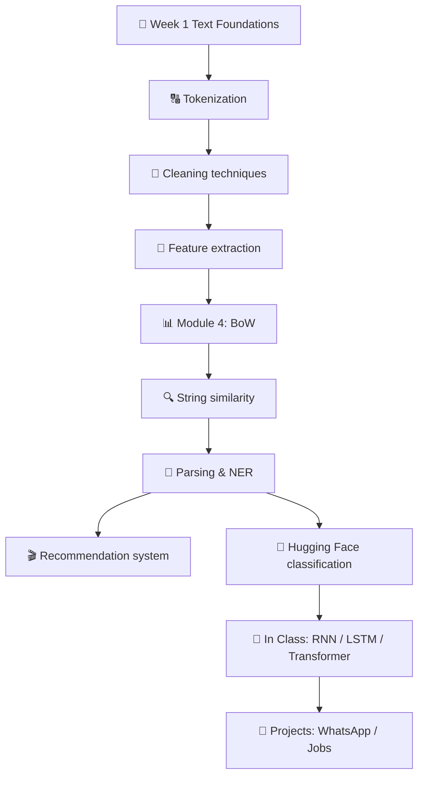

<div align="center">

# 🗣️ NLP — Natural Language Processing

### *A complete journey from raw text to transformers*

[](https://www.nltk.org/)
[](https://spacy.io/)
[](https://radimrehurek.com/gensim/)
[](https://huggingface.co/)
[](https://www.tensorflow.org/)

</div>

> A hands-on collection of NLP notebooks and scripts, organized so each folder is a **single, focused topic**.
> Goes all the way from `str.split()` tokenization to **transformer pipelines** and **RNN translation**.

---

## 🗺️ Learning Path



---

## 📁 Folder Map

| Folder | Topic | Highlights |
|--------|-------|-----------|
| 📂 [`Week 1 Text Foundations/`](./Week%201%20Text%20Foundations/) | Core building blocks | Tokenizers, stemmers, lemmatizers, BoW, TF-IDF, similarity |
| 📂 [`Tokenization/`](./Tokenization/) | Splitting text | Word vs sentence tokenization with NLTK |
| 📂 [`cleaning and its techniques/`](./cleaning%20and%20its%20techniques/) | Text preprocessing | Stop words, punctuation, stemming, lemmatization |
| 📂 [`Feature extraction/`](./Feature%20extraction/) | Text → vectors | BoW, TF-IDF, GloVe embeddings + PCA |
| 📂 [`module 4 feature extraction/`](./module%204%20feature%20extraction/) | More BoW | A focused BoW notebook |
| 📂 [`string similarity (distances)/`](./string%20similarity%20%28distances%29/) | Comparing strings | Edit distance, Jaccard, cosine |
| 📂 [`parsing/`](./parsing/) | Syntactic structure | POS tagging, dependency parsing |
| 📂 [`named entity recognition and extraction/`](./named%20entity%20recognition%20and%20extraction/) | NER | Extract people, places, orgs from text |
| 📂 [`Recommendation_System/`](./Recommendation_System/) | 🎬 Project | TF-IDF + cosine similarity movie recommender |
| 📂 [`text classification using hugging face/`](./text%20classification%20using%20hugging%20face/) | Transformers | Sentiment, zero-shot, QNLI pipelines |
| 📂 [`jobs_applicants_project/`](./jobs_applicants_project/) | 💼 Project | NLP on job-applicant data |
| 📂 [`whatapp project/`](./whatapp%20project/) | 💬 Project | WhatsApp chat analysis |
| 📂 [`In Class/`](./In%20Class/) | 🎓 Lectures | Classroom material — RNN, LSTM, Transformer, Word2Vec |

---

## 🧠 Topics by Category

### 🟢 Foundations
- Tokenization — `word_tokenize`, `sent_tokenize`, regex, spaCy, GPT-2 BPE
- Cleaning — lowercasing, stop-word & punctuation removal
- Stemming (PorterStemmer) vs Lemmatization (WordNetLemmatizer)
- Full preprocessing pipelines

### 🟡 Representation
- **Bag of Words** (`CountVectorizer`)
- **TF-IDF** (`TfidfVectorizer`)
- **N-grams** for capturing local word order
- **Word embeddings** — pre-trained GloVe via Gensim + PCA visualization

### 🟡 Similarity & Search
- Levenshtein edit distance (character level)
- Jaccard similarity (set level)
- Cosine similarity on TF-IDF vectors (document level)
- Mini search engine prototype

### 🔴 Advanced
- **Named Entity Recognition** with spaCy
- **Syntactic parsing** — POS tags & dependency trees
- **Hugging Face pipelines** — `sentiment-analysis`, zero-shot, QNLI
- **Word2Vec** training
- **RNN** / **LSTM** sequence modelling
- **Transformer (Keras)** from scratch
- **RNN-based translation** (TimeDistributed & single-word)

### 🎯 Projects
- 🎬 Movie recommendation system (TF-IDF + cosine)
- 💼 Job-applicant text analysis
- 💬 WhatsApp chat analysis

---

## 🛠️ Requirements

```bash
pip install nltk spacy scikit-learn gensim transformers tensorflow \
            matplotlib seaborn pandas numpy tabulate python-Levenshtein
```

### NLTK resources
```python
import nltk
nltk.download('punkt')
nltk.download('stopwords')
nltk.download('wordnet')
nltk.download('averaged_perceptron_tagger')
```

### spaCy model
```bash
python -m spacy download en_core_web_sm
```

---

## ▶️ Where to Start

| You want to… | Open |
|--------------|------|
| Learn from the ground up | [`Week 1 Text Foundations/`](./Week%201%20Text%20Foundations/) |
| See bite-size examples | [`Tokenization/`](./Tokenization/), [`cleaning and its techniques/`](./cleaning%20and%20its%20techniques/) |
| Convert text to vectors | [`Feature extraction/`](./Feature%20extraction/) |
| Build a real app | [`Recommendation_System/`](./Recommendation_System/) |
| Use modern transformers | [`text classification using hugging face/`](./text%20classification%20using%20hugging%20face/) |
| See neural networks for NLP | [`In Class/`](./In%20Class/) |

---

## 💡 Key NLP Takeaways

| Topic | Remember |
|-------|---------|
| Tokenization | No single "best" tokenizer — match it to your task |
| Stop words | Removing them is NOT always correct (sentiment, negations!) |
| Stemming vs Lemmatization | Stem = fast & approximate; Lemma = linguistically accurate |
| Bag of Words | Simple & strong baseline — bigrams capture some order |
| TF-IDF | Rewards locally frequent AND globally rare words |
| Embeddings | Capture semantic meaning — "king − man + woman ≈ queen" |
| Transformers | Today's state of the art — start with Hugging Face pipelines |

---

## 📚 Further Reading

- [NLTK Book](https://www.nltk.org/book/) — Chapters 1–3
- [spaCy 101](https://spacy.io/usage/spacy-101)
- [Hugging Face Tokenizer docs](https://huggingface.co/docs/tokenizers)
- [scikit-learn: Text Feature Extraction](https://scikit-learn.org/stable/modules/feature_extraction.html)
- [Jurafsky & Martin — *Speech and Language Processing*](https://web.stanford.edu/~jurafsky/slp3/)
