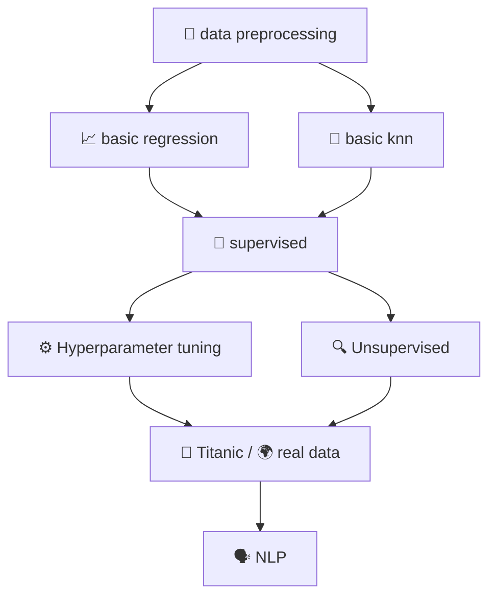

<div align="center">

# 🤖 ML Practice

### *A complete, hands-on Machine Learning learning lab*

[](https://www.python.org/)
[](https://jupyter.org/)
[](https://scikit-learn.org/)
[](https://pandas.pydata.org/)
[](https://www.nltk.org/)
[](#-license)

*From raw CSVs to deep NLP — explore the full ML workflow notebook by notebook.*

</div>

---

## 🌟 About This Repository

**ML Practice** is a curated collection of Jupyter notebooks and Python scripts that walk through the **entire machine learning pipeline** — preprocessing, classical algorithms, hyperparameter tuning, unsupervised learning, NLP and end-to-end projects.

Every folder is a self-contained mini-lesson with its own dataset, code and README. Whether you are revising fundamentals or looking for working code to adapt, this repo is meant to be read, run and remixed.

> 📌 Built as a personal learning journal — kept open in the hope it is useful to others too.

---

## 📁 Repository Map

```
ML_Practice/
│
├── 🧹 data preprocessing/      Handling missing values, encoding & scaling
├── 📈 basic regression/        Linear, Ridge, Lasso & Logistic regression
├── 🔵 basic knn/               K-Nearest Neighbors fundamentals
├── 🧠 supervised/              Classification & regression (sklearn)
├── 🔍 Unsupervised/            K-Means clustering & PCA
├── ⚙️  Hyperparameter tuning/  GridSearchCV & RandomizedSearchCV
├── 🗣️  NLP/                    Text processing, embeddings, transformers, RAG & agents
├── 🔤 NLP using spaCy/         Getting started with spaCy models
├── 🚢 Titanic/                 End-to-end Kaggle-style project
├── 🌍 real data/               Practice on real-world scraped datasets
├── 📓 all.ipynb                Consolidated multi-experiment notebook
└── 📓 Common Deep Learning     Common deep learning hyperparameters reference
       Hyper-Parameters.ipynb
```

Each top-level folder has its **own README** with a deeper walkthrough — click into one to see what's inside.

---

## 🗺️ Suggested Learning Path



| Stage | Folder | Why it matters |
|------:|--------|----------------|
| 1 | `data preprocessing/` | Garbage in → garbage out. Learn to clean first. |
| 2 | `basic regression/` | Build intuition for the loss → fit → evaluate cycle. |
| 3 | `basic knn/` | A first taste of classification with no training phase. |
| 4 | `supervised/` | Trees, forests, SVMs, gradient boosting — the workhorses. |
| 5 | `Hyperparameter tuning/` | Stop guessing — let the search find your best model. |
| 6 | `Unsupervised/` | Learn from unlabeled data with clustering and PCA. |
| 7 | `Titanic/` & `real data/` | Apply everything on real datasets, end-to-end. |
| 8 | `NLP/` | Move from numbers to text, embeddings and transformers. |

---

## 📚 What You'll Find Inside

<details>
<summary><b>🧹 Data Preprocessing</b></summary>

- Missing-value imputation strategies
- Label encoding & one-hot encoding for categorical features
- Feature scaling — `StandardScaler`, `MinMaxScaler`
- Train / test splitting & data leakage pitfalls

</details>

<details>
<summary><b>📈 Basic Regression</b></summary>

- Simple, Multiple & Polynomial Linear Regression
- **Ridge** (L2) and **Lasso** (L1) regularization
- **Logistic Regression** for classification
- Model evaluation: R², MAE, MSE, RMSE
- Cross-validation with 95% confidence intervals (`visual CV Lreg.py`)

</details>

<details>
<summary><b>🔵 K-Nearest Neighbors</b></summary>

- Distance metrics (Euclidean, Manhattan)
- Choosing the optimal `k`
- Decision boundary visualization
- KNN for both classification and regression

</details>

<details>
<summary><b>🧠 Supervised Learning</b></summary>

- Logistic Regression, Decision Trees, Random Forests
- Support Vector Machines (SVM), Naive Bayes
- Gradient Boosting
- Confusion matrix, precision / recall / F1

</details>

<details>
<summary><b>🔍 Unsupervised Learning</b></summary>

- **K-Means** clustering (Iris, GitHub & Kaggle datasets)
- Hierarchical clustering
- **PCA** for dimensionality reduction
- End-to-end Penguin species clustering project

</details>

<details>
<summary><b>⚙️ Hyperparameter Tuning</b></summary>

- `GridSearchCV` exhaustive search
- `RandomizedSearchCV` for big search spaces
- K-Fold cross-validation
- sklearn `Pipeline` construction

</details>

<details>
<summary><b>🗣️ Natural Language Processing</b></summary>

- Tokenization (NLTK, spaCy, GPT-2 BPE, BERT WordPiece)
- Stemming, lemmatization, stop-word removal
- Bag-of-Words, TF-IDF and N-grams
- GloVe word embeddings + PCA visualization
- Named entity recognition & parsing (spaCy + Hugging Face models)
- **Hugging Face** transformers — sentiment, zero-shot, QNLI, CoLA, QQP
- Question answering — extractive (DistilBERT/SQuAD) and abstractive (HotpotQA)
- Sequence generation — search completion, summarization, translation
- Neural networks: RNNs, LSTMs, Word2Vec, Transformers (Keras)
- BM25 sparse retrieval and dense retrieval with sentence embeddings
- RAG (Retrieval-Augmented Generation) pipelines
- LLM Agents — research, analyst, support, LangChain, LangGraph
- Mini projects: movie recommender, WhatsApp chat analysis, job applications

</details>

<details>
<summary><b>🚢 End-to-End Projects</b></summary>

- **Titanic** — EDA → feature engineering → Kaggle-style submission
- **Stack Overflow real data** — exploring scraped user-profile data

</details>

---

## 🛠️ Tech Stack

| Category | Tools |
|----------|-------|
| **Language** | Python 3.7+ |
| **Environment** | Jupyter Notebook |
| **Data** | `pandas`, `numpy` |
| **Classical ML** | `scikit-learn` |
| **Visualization** | `matplotlib`, `seaborn` |
| **NLP** | `nltk`, `spaCy`, `gensim`, `transformers` |
| **Deep Learning** | `tensorflow` / `keras` (for NLP modules) |

---

## 🚀 Getting Started

### 1. Clone the repository
```bash
git clone https://github.com/Nihalpujari/ML_Practice.git
cd ML_Practice
```

### 2. (Recommended) Create a virtual environment
```bash
python -m venv .venv
# Windows
.venv\Scripts\activate
# macOS / Linux
source .venv/bin/activate
```

### 3. Install dependencies
```bash
pip install numpy pandas scikit-learn matplotlib seaborn jupyter \
            nltk spacy gensim transformers
```

### 4. Download NLP resources (one-time, for the NLP modules)
```python
import nltk
nltk.download('punkt')
nltk.download('stopwords')
nltk.download('wordnet')
```
```bash
python -m spacy download en_core_web_sm
```

### 5. Launch Jupyter
```bash
jupyter notebook
```

Then open any folder and start with its `*.ipynb` file.

---

## 📖 How to Use This Repo

| You are… | Start here |
|----------|-----------|
| 🌱 **A beginner** | `data preprocessing/` → `basic regression/` → `basic knn/` |
| 🌿 **Intermediate** | `supervised/`, `Unsupervised/`, `Hyperparameter tuning/` |
| 🗣️ **An NLP fan** | `NLP/Week 1 Text Foundations/` then the topic subfolders |
| 🛠️ **Project hunter** | `Titanic/`, `real data/`, `NLP/Recommendation_System/` |
| 🔎 **Just browsing** | `all.ipynb` for a multi-experiment overview |

---

## 🤝 Contributing

Pull requests are welcome! If you spot a bug, want to add a notebook, or improve documentation:

1. Fork the repository
2. Create a feature branch — `git checkout -b feature/your-topic`
3. Commit your changes — `git commit -m "Add notebook on XYZ"`
4. Push the branch — `git push origin feature/your-topic`
5. Open a Pull Request

---

## 📬 Contact

**Nihal Pujari**
🔗 GitHub: [@Nihalpujari](https://github.com/Nihalpujari)

---

## 📄 License

This project is open-source and available for **personal learning and educational use**.

---

<div align="center">

⭐ **If this repo helped your ML journey, please leave a star — it really helps!** ⭐

</div>
