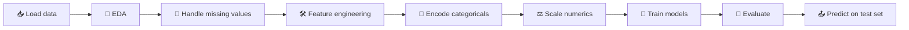

# 🚢 Titanic — End-to-End ML Project

> The most iconic beginner ML project. Predict who survived the sinking of the RMS Titanic, given passenger data.
> A complete workflow: **EDA → preprocessing → modelling → predictions**.

[](https://www.kaggle.com/competitions/titanic)

---

## 📂 Contents

| File | Purpose |
|------|---------|
| `Titanic.ipynb` | Full notebook — EDA, feature engineering, modelling, predictions |
| `train.csv` | Training data (891 rows) with the `Survived` label |
| `test.csv` | Test data (418 rows) — no labels (for Kaggle submission) |

---

## 📊 Dataset

| Column | Meaning |
|--------|---------|
| `PassengerId` | Unique row ID |
| `Survived` | 🎯 Target: 1 = survived, 0 = died |
| `Pclass` | Ticket class (1 / 2 / 3) |
| `Name` | Passenger name (contains title — *Mr.*, *Mrs.*, *Master*…) |
| `Sex` | Male / female |
| `Age` | Age in years (has missing values) |
| `SibSp` | # of siblings / spouses aboard |
| `Parch` | # of parents / children aboard |
| `Ticket` | Ticket number |
| `Fare` | Ticket fare |
| `Cabin` | Cabin number (mostly missing!) |
| `Embarked` | Port of embarkation (C / Q / S) |

---

## 🧭 Notebook Workflow



### 1. EDA — Exploratory Data Analysis
- Distribution of survival by `Sex`, `Pclass`, `Age`
- Correlation heatmaps
- Missing-value heatmap

### 2. Preprocessing
- **Impute `Age`** — by group median (e.g. median age per title)
- **Impute `Embarked`** — fill with the mode
- **Drop `Cabin`** *or* extract its first letter (deck)
- **Encode** `Sex`, `Embarked`

### 3. Feature Engineering
Classic Titanic tricks:
- Extract **`Title`** from `Name` — *Mr*, *Mrs*, *Miss*, *Master*, *Rare*
- Create **`FamilySize`** = `SibSp + Parch + 1`
- Create **`IsAlone`** = 1 if `FamilySize == 1`
- Bin **`Age`** and **`Fare`** into categories

### 4. Modelling
Try and compare multiple models:
- Logistic Regression
- Decision Tree
- Random Forest
- Gradient Boosting (e.g. XGBoost)

### 5. Submission
Generate `submission.csv` with two columns — `PassengerId, Survived` — ready to upload to Kaggle.

---

## 🛠️ Requirements

```bash
pip install pandas numpy scikit-learn matplotlib seaborn jupyter
```

---

## ▶️ Run

```bash
jupyter notebook Titanic.ipynb
```

---

## 💡 Tips

- 👩 **Sex is the single strongest predictor** — start with a simple "women survive" baseline. Anything you build later should beat that.
- 👶 **Children too** — `Title == 'Master'` is a useful signal.
- 💎 **`Pclass`** also dominates — wealthier passengers had better lifeboat access.
- Use **`Pipeline` + `ColumnTransformer`** to avoid mixing imputation/scaling logic with model code.
- **Don't tune on the test set** — split train into train/val first.

---

## 🏆 Aim For

- Baseline (sex-only): ~76%
- Logistic Regression: ~79%
- Random Forest / Gradient Boosting (well-tuned): **>82%** — that's a solid public-leaderboard score.
